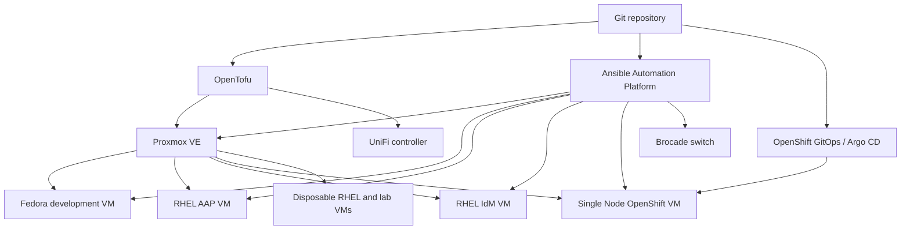

# Homelab Infrastructure

Configuration, architecture, and recovery material for a Dell PowerEdge R720.
The host runs Proxmox VE and provides the primary Fedora development
environment, RHEL systems, Ansible Automation Platform, and an OpenShift lab.

This repository is currently a **planning scaffold**. No resource in the live
environment is managed from this repository yet.

## Target architecture

Proxmox and OpenTofu form the infrastructure layer. Red Hat technologies own
the workload layer: RHEL, Fedora, AAP, IdM, Podman, Image Builder or `bootc`,
and OpenShift. AAP runs on a RHEL VM outside OpenShift so it remains available
to diagnose or rebuild the cluster.

## Repository map

| Path | Purpose |
|---|---|
| `inventory/` | Observed physical and logical inventory without credentials |
| `docs/architecture.md` | Component boundaries and failure domains |
| `docs/implementation-plan.md` | Ordered delivery plan and completion evidence |
| `docs/storage-plan.md` | Pool layout, boot resilience, and disk identities |
| `docs/networking-plan.md` | Management and workload network design |
| `docs/brocade-projects.md` | Prioritized ICX experiments and community patterns |
| `network/` | Brocade and UniFi ownership, adoption, and recovery contracts |
| `docs/backup-recovery.md` | Backup, restore, UPS, and bare-metal recovery |
| `docs/decisions/` | Architecture Decision Records |
| `tofu/` | Future Proxmox resource definitions |
| `ansible/` | Future AAP projects, roles, rulebooks, and execution environments |
| `cloud-init/` | Future guest bootstrap data |
| `openshift/` | Future installation and GitOps configuration |

## Current priorities

1. Correct the ZFS host-ID warning and prove repeatable unattended boots.
2. Reseat DIMM A2, install the purchased memory, and refresh inventory.
3. Make the SATA EFI and `/boot` path redundant.
4. Remove stale installer media and normalize Proxmox package repositories.
5. Build storage pools using stable device identifiers.
6. Establish management networking, DNS, certificates, and remote access.
7. Import the Brocade and UniFi configuration into reviewed management workflows.
8. Deploy the Fedora development VM, AAP, IdM, and OpenShift in that order.
9. Establish independent backups, alerts, and tested recovery.

See [the implementation plan](docs/implementation-plan.md) for gates and
dependencies.

## Operating principles

- Git records desired state and rationale; it does not contain mutable data or
  credentials.
- Backups provide recovery. Redundancy provides availability and lets ZFS heal
  damaged blocks. Protection is selected per storage tier.
- Workloads do not run directly on the Proxmox host.
- The PVE GUI is valid for inspection and emergencies. Persistent changes are
  imported or represented in code afterward.
- Every destructive storage action is keyed to a recorded serial number.
- OpenShift, AAP, and the development VM share one physical failure domain;
  their backups must not.
