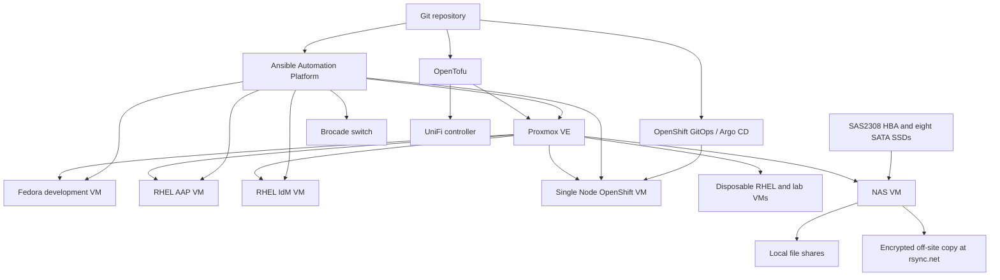

# Homelab Infrastructure

Configuration, architecture, and recovery material for a Dell PowerEdge R720.
The host runs Proxmox VE. The Fedora development VM is now managed through the
versioned OpenTofu and Ansible configuration; RHEL systems, Ansible Automation
Platform, and OpenShift remain planned.

This repository holds the target architecture and versioned host-maintenance
procedures. The NAS has not yet been deployed.

See [CONTRIBUTING.md](CONTRIBUTING.md) for branch, review, and verification
practice.

## Target architecture

```mermaid
flowchart TD
    Git[Git repository] --> Tofu[OpenTofu]
    Git --> AAP[Ansible Automation Platform]
    Git --> Argo[OpenShift GitOps / Argo CD]

    Tofu --> PVE[Proxmox VE]
    PVE --> Dev[Fedora development VM]
    PVE --> AAPVM[RHEL AAP VM]
    PVE --> IdM[RHEL IdM VM]
    PVE --> OCP[Single Node OpenShift VM]
    PVE --> Lab[Disposable RHEL and lab VMs]
    PVE --> NAS[NAS VM]
    HBA[SAS2308 HBA and eight SATA SSDs] --> NAS
    NAS --> Shares[Local file shares]
    NAS --> Remote[Encrypted off-site copy at rsync.net]

    AAP --> PVE
    AAP --> Dev
    AAP --> AAPVM
    AAP --> IdM
    AAP --> OCP
    AAP --> Brocade[Brocade switch]
    Tofu --> UniFi[UniFi controller]
    Argo --> OCP
```

Proxmox and OpenTofu form the infrastructure layer. Red Hat technologies own
the workload layer: RHEL, Fedora, AAP, IdM, Podman, Image Builder or `bootc`,
and OpenShift. AAP runs on a RHEL VM outside OpenShift so it remains available
to diagnose or rebuild the cluster.

The NAS VM boots from Proxmox's `fast-vm` mirror and owns the complete SATA HBA
and its RAIDZ2 pool. It is local primary storage, not the off-site backup.
Other VMs do not boot from storage exported by this NAS. See the
[storage plan](docs/storage-plan.md) and [NAS decision](docs/decisions/0010-run-the-bulk-nas-as-a-vm-with-hba-passthrough.md).

## Repository map

| Path | Purpose |
|---|---|
| `CONTRIBUTING.md` | Branch, review, and verification process |
| `inventory/` | Observed physical and logical inventory without credentials |
| `docs/architecture.md` | Component boundaries and failure domains |
| `docs/implementation-plan.md` | Ordered delivery plan and completion evidence |
| `docs/storage-plan.md` | Pool layout, boot resilience, and disk identities |
| `docs/nas-implementation-plan.md` | NAS passthrough, guest pool, shares, and off-site recovery gates |
| `docs/networking-plan.md` | Management and workload network design |
| `docs/brocade-projects.md` | Prioritized ICX experiments and community patterns |
| `network/` | Brocade and UniFi ownership, adoption, and recovery contracts |
| `docs/backup-recovery.md` | Backup, restore, UPS, and bare-metal recovery |
| `docs/decisions/` | Architecture Decision Records |
| `host/pve/` | Workstation-runnable Proxmox host checks and maintenance |
| `tofu/` | Proxmox VM resource definitions and plan safeguards |
| `ansible/` | Guest configuration and future AAP projects and execution environments |
| `cloud-init/` | Future guest bootstrap data |
| `openshift/` | Future installation and GitOps configuration |
| `openspec/` | Staged infrastructure change proposals and task gates |

## Delivery map

1. Keep PVE recovery and boot evidence current; complete boot redundancy and
   the verified memory expansion as separate maintenance work.
2. Establish recoverable OpenTofu state, scoped PVE access, and a disposable VM
   lifecycle test.
3. Keep the reproducible Fedora VM empty of unique data; deploy the NAS VM on
   `fast-vm` and reserve the SATA HBA and its eight SSDs for the NAS guest.
   Do not create a host `bulk` pool.
4. Configure and restore-test encrypted rsync.net backups before either guest
   holds unique data or Fedora becomes the primary workspace.
5. Expand management networking and deploy AAP, IdM, and OpenShift under their
   separate ownership and recovery gates.

See [the implementation plan](docs/implementation-plan.md) for gates and
dependencies.

## Operating principles

- Git records desired state and rationale; it does not contain mutable data or
  credentials.
- Backups provide recovery. Redundancy provides availability and lets ZFS heal
  damaged blocks. Protection is selected per storage tier.
- Workloads do not run directly on the Proxmox host.
- The PVE GUI is valid for inspection and emergencies. Persistent changes are
  imported or represented in code afterward.
- Every destructive storage action is keyed to a recorded serial number.
- OpenShift, AAP, and the development VM share one physical failure domain;
  their backups must not.
